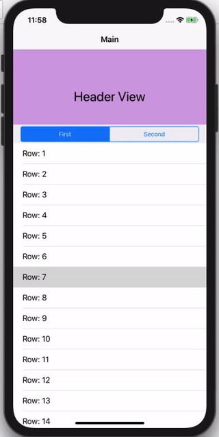

# StickyPagingHeader

    StickyPagingHeader is a demo project to show scrollable header on top of multiple scrolling type views bind under a single page view controller. Here is the demo:

Please contribute to this project to make it scrollable like Twitter profile view header and sub view scolling along with sticky segmented controller. 
